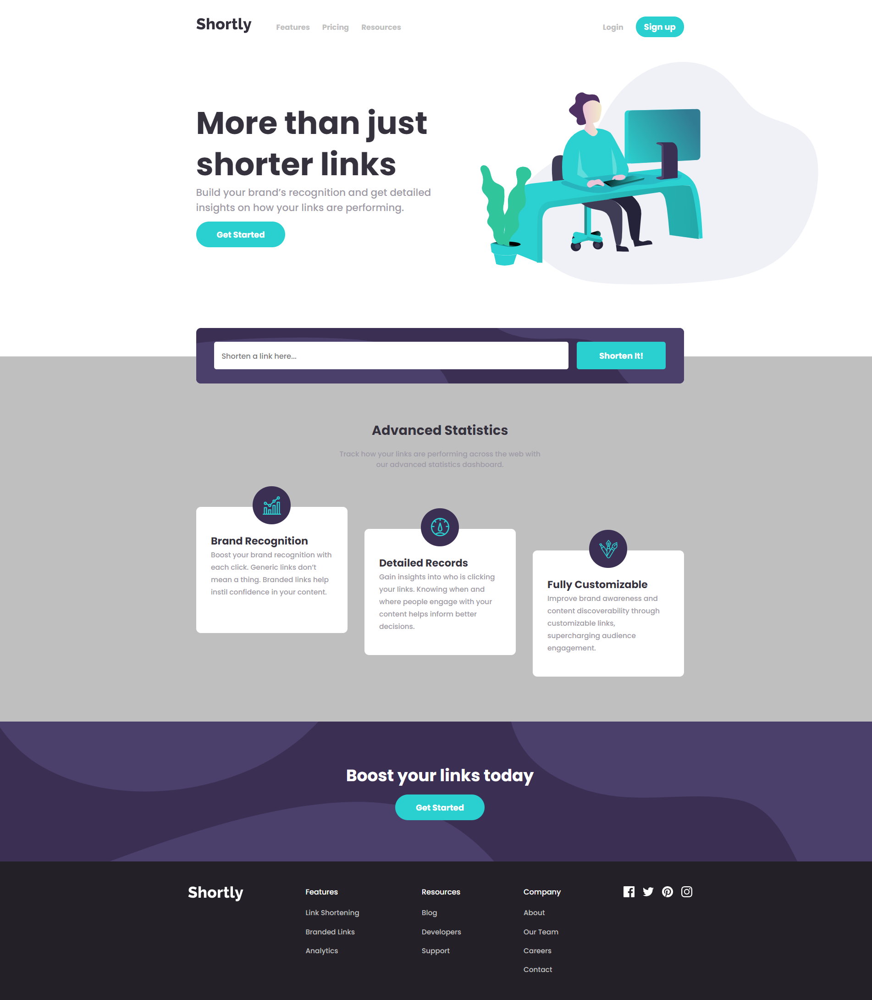
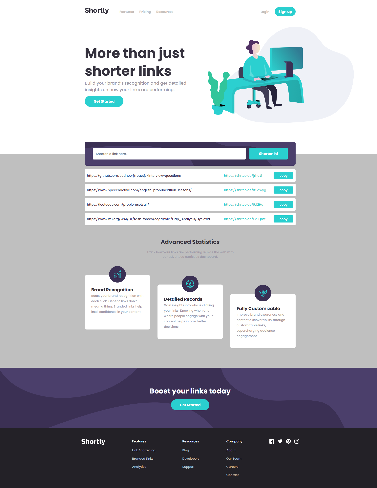
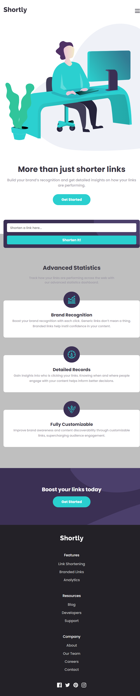
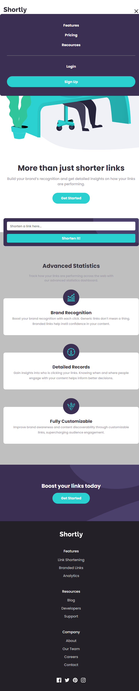

# Shortly URL shortening API solution

This is a solution to Shortly URL shortening API. It is to build out this landing page, integrate with the [shrtcode API](https://app.shrtco.de/) and get it looking as close to the design as possible.

The users should be able to:

- View the optimal layout for the site depending on their device's screen size
- Shorten any valid URL
- See a list of their shortened links
- Copy the shortened link to their clipboard in a single click
- Receive an error message when the `form` is submitted if:
  - The `input` field is empty

## Table of contents

- [Overview](#overview)
  - [Link](#link)
  - [Screenshots](#screenshot)
- [My process](#my-process)
  - [Built with](#built-with)
- [Author](#author)

## Overview

### Link

- Solution URL: [Shortly URL shortening API](https://aislandmin.github.io/Shortly-URL-shortening-API/)

### Screenshot

## My process

### Built with

- Semantic HTML5 markup
- CSS custom properties
- Flexbox
- CSS Grid
- Mobile-first workflow
- Fetch
- [shrtcode API](https://app.shrtco.de/)

## Author

- Website - [Xiaomin Guo](https://min-website-aislandmin.vercel.app/)
